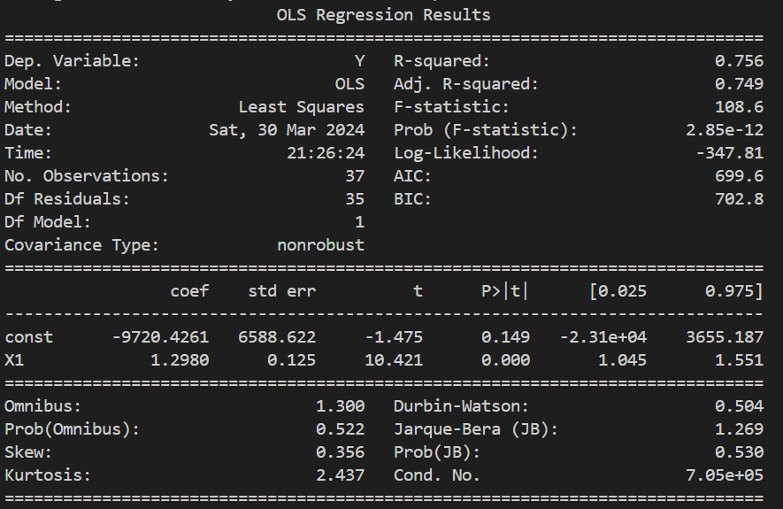
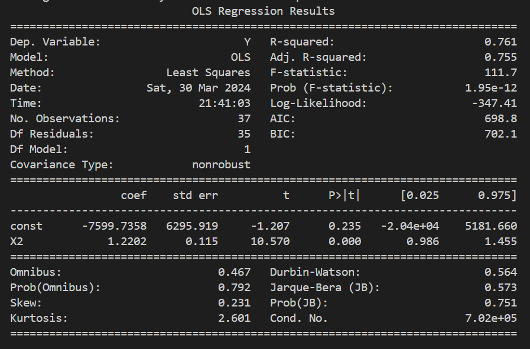

# SAPM_Task_2022B3A81242P

Linear regressions were run for BSE Stock Index upon Money Supply factors M1 and M2. Since values of M1 and M2 have perfect correlation with each other, we use each variable in a separate regression to test significance while avoiding multicollinearity. The code used, along with the data is attached to the repository while the results of the regression are added to the readme file

This image is for the regression of BSE Index upon M1. Value of M1 has been scaled down to ensure a good fit for the model

The below image is for the regression of BSE Index upon M2. Value of M2 has been scaled down to ensure a good fit for the model.

